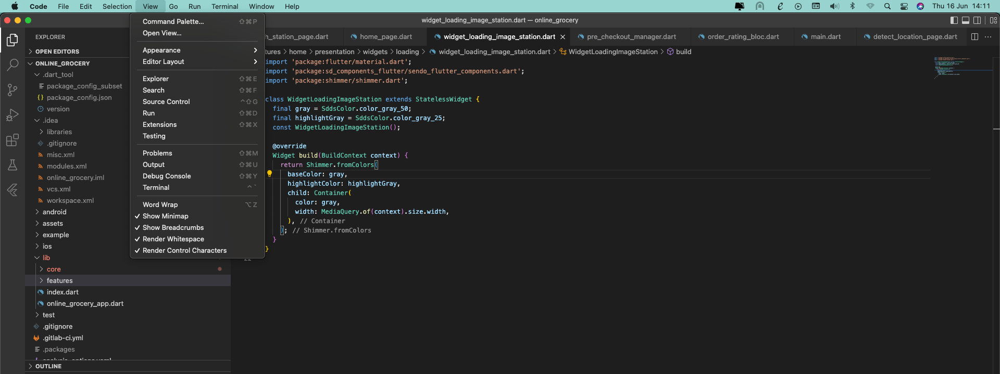
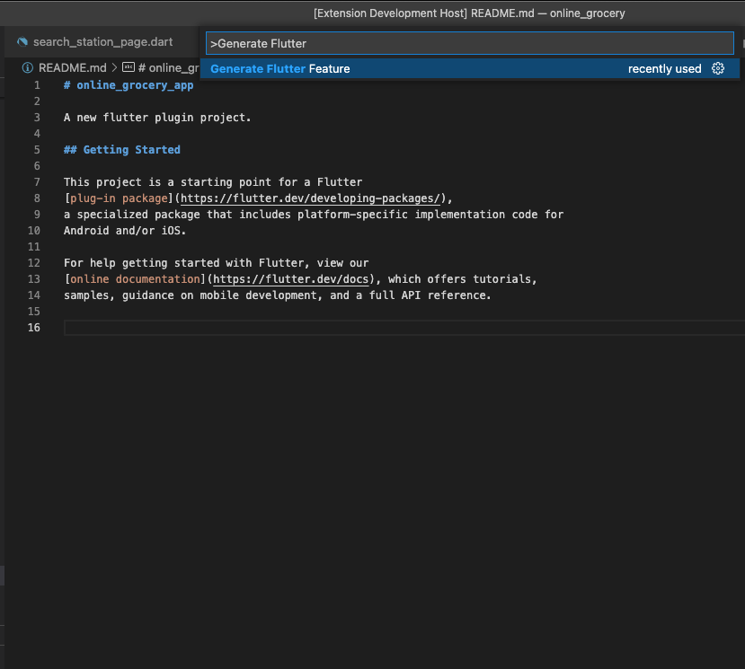
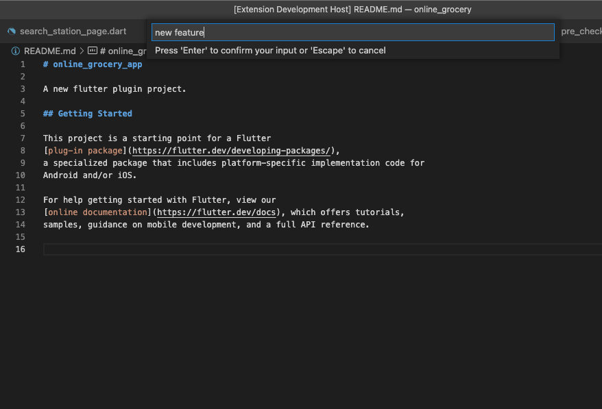
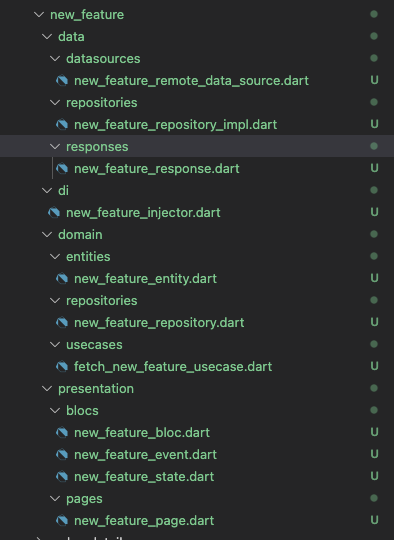

# Visual Plugin to generate Clean Architect template for Flutter Project
## Features

- Generate files and folders based on Clean Architect template from [Resocoder Blog](https://resocoder.com/2019/08/27/flutter-tdd-clean-architecture-course-1-explanation-project-structure/)

## How To Use
Open Visual Studio Code -> View -> Command Palette... -> Generate Flutter Feature -> Input your feature name

    

